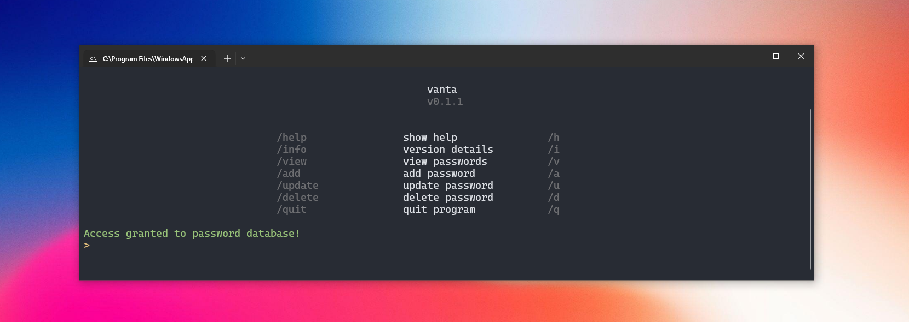

# Vanta

## A secure and user-friendly CLI password manager.

Vanta is a command-line interface (CLI) password manager designed for secure and easy management of your login credentials. It uses strong encryption and provides a straightforward interface for viewing, adding, updating, and deleting your passwords.



## Features

* **Secure Encryption**: Utilizes `bcrypt` for master password hashing and `Fernet` (symmetric encryption from `cryptography` library) with a derived key for encrypting stored passwords, ensuring your sensitive data is protected.
* **Master Password Management**: Allows you to create your own master password or generate a strong, random one.
* **Intuitive CLI**: Easy-to-use command-line interface with clear prompts and command shortcuts.
* **Password Complexity Checks**: Enforces complexity requirements for user-created passwords.
* **Password Generation**: Generate strong, random passwords for your new entries.
* **Organized Storage**: Stores website, username, and encrypted password entries in a SQLite database.
* **Clear Display**: Presents your stored passwords in a readable table format.
* **Cross-Platform Compatibility**: Automatically determines and uses platform-appropriate paths for database storage.


## Installation

### Requirements

* Python 3.x
* `bcrypt`
* `cryptography`
* `rich`

You can install the required Python packages using pip:

```bash
pip install -r requirements.txt
````

## Usage

1.  **Clone the repository:**

    ```bash
    git clone https://github.com/eelixir/vanta.git
    cd vanta
    ```

2.  **Run the password manager:**

    ```bash
    python src/main.py
    ```

### First-Time Setup

Upon the first run, Vanta will detect that no master password exists and prompt you to create one:

```
Welcome to Vanta Password Manager
No master password found. Please create one.
> Choose master password method - /create to type your own, /generate for a random one:
```

  * Type `/create` or `/c` to enter your own master password.
  * Type `/generate` or `/g` to have Vanta generate a strong, random master password for you. **Make sure to securely store this generated password as it will not be shown again.**

### Authentication

After setting up or if a master password already exists, you will be prompted to enter it to access your vault:

```
> Enter master password:
```

### Commands

Once authenticated, you will see a list of available commands:

```
> /help            show help              /h
> /info            version details        /i
> /view            view passwords         /v
> /add             add password           /a
> /update          update password        /u
> /delete          delete password        /d
> /quit            quit program           /q
```

  * `/help` or `/h`: Displays the list of available commands.
  * `/info` or `/i`: Shows version details and the GitHub repository link.
  * `/view` or `/v`: Lists all your stored password entries. You can then enter an ID to view the decrypted password for that entry.
  * `/add` or `/a`: Guides you through adding a new password entry, allowing you to create your own password or generate a random one.
  * `/update` or `/u`: Allows you to select an entry by ID and update its username and/or password.
  * `/delete` or `/d`: Lets you select an entry by ID to delete it from the database after a confirmation prompt.
  * `/quit` or `/q`: Exits the program.
